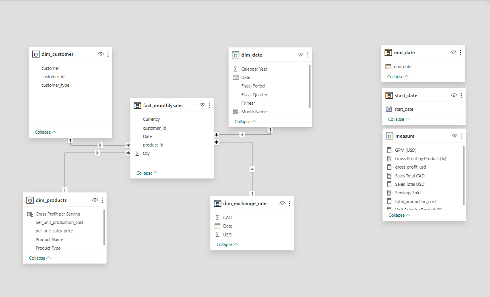
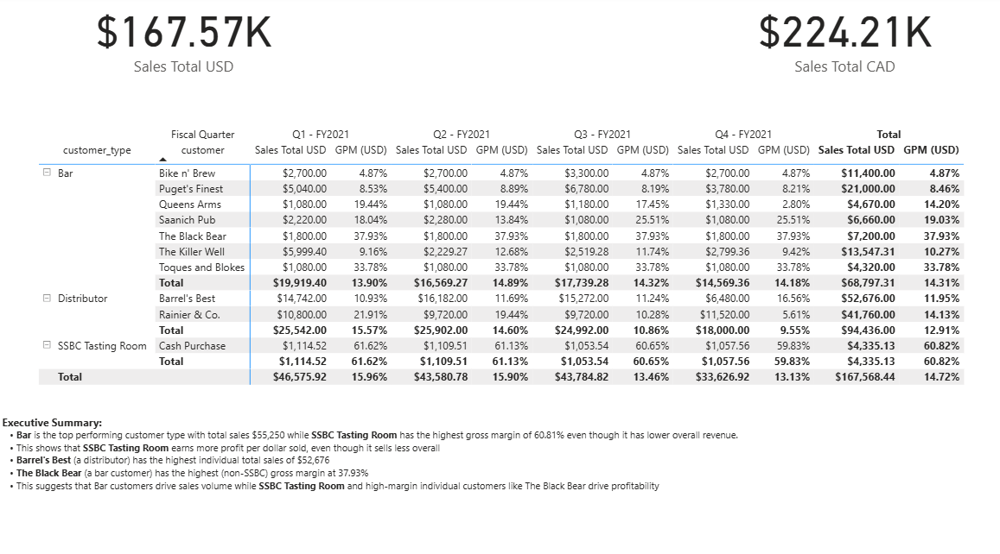
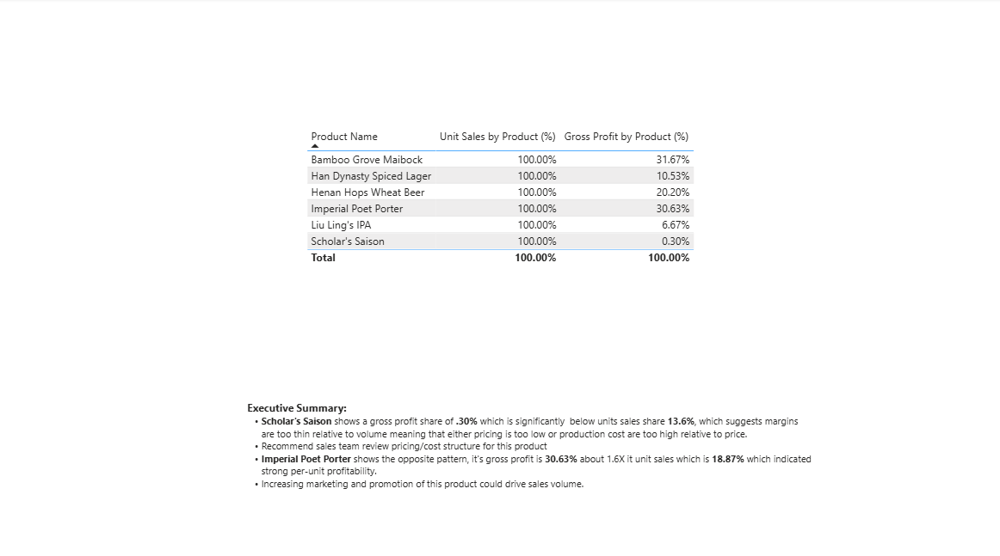
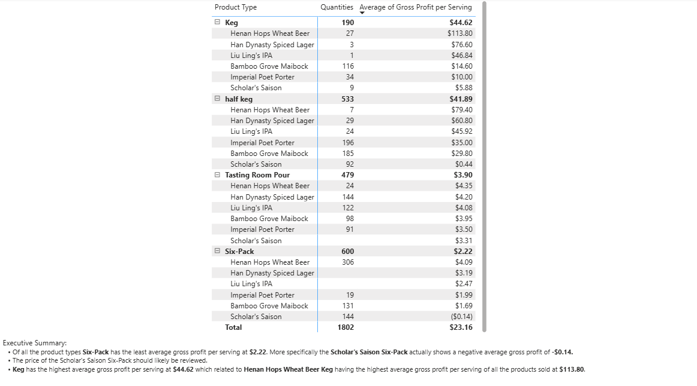
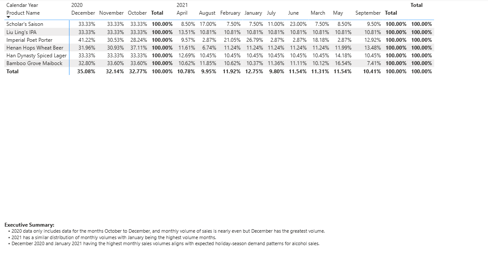

# 🍺 SSBC Sales & Profitability Analysis — Power BI Project

**End-to-end business intelligence project** covering data transformation, data modeling, DAX measure development, and executive dashboard design for a craft brewery's sales, cost, and profitability reporting.


---

## 📌 Project Overview

SSBC (a craft brewery) needed a centralized reporting solution to track **sales performance, cost of goods, and gross profit margin** across products, customers, and currencies (USD/CAD). Raw data arrived as disconnected source files (currency rates, customer lists, product catalog, and transactional sales) with inconsistent formatting and typos that would break downstream reporting.

This project takes that raw data from **source files → cleaned & modeled data → validated DAX measures → executive-ready dashboard**, simulating the real workflow of a BI/data analyst supporting a stakeholder request.

**Business questions answered:**
- What are total sales and gross profit margin, in both USD and CAD?
- Which products and customer types drive the most revenue and profit?
- Which product *type* (e.g., Keg vs. Six-pack) is most profitable *per serving*?
- Does beer sell differently by month — is there seasonality?

---

## 🧰 Tools & Skills Demonstrated

| Skill Area | Application in This Project |
|---|---|
| **Power Query (M)** | Source-to-model ETL: transforming, cleaning, and reshaping 4 source files into a star schema |
| **Data Modeling** | Designed a single fact table with four dimension tables in a proper star schema (1-to-many relationships) |
| **Dynamic Date/Calendar Table** | Built a fully custom date table in Power Query, dynamically ranged to the fact table and enriched with fiscal calendar logic |
| **DAX** | Wrote calculated measures (not hardcoded values) for currency conversion, profitability, and share-of-total analysis |
| **Data Cleaning** | Identified and corrected typos/inconsistencies (e.g., duplicate/misspelled customer type categories) that would have fragmented reporting categories |
| **Dashboard Design** | Built a multi-tab report with cards, matrices, and an executive summary aimed at a non-technical stakeholder audience |
| **QA / Validation** | Cross-checked visual outputs against expected totals to confirm the model and measures were calculating correctly |

---

## 🗂️ Data Model

The model follows a **star schema**: one central fact table surrounded by four dimension tables, each joined in a one-to-many relationship (dimension → fact).

```
        dim_customer        dim_date
              \                /
               \              /
              fact_monthlysales (the "many" side)
               /              \
              /                \
        dim_products       dim_exchange_rate
```

**Fact table:** `fact_monthlysales` — transactional sales data (units, product, customer, date, currency) Monthly Sales Logs folder containing monthly xlsx files
 
**Dimension tables:**
- `dim_exchange_rate` — sourced and cleaned from `USD-CAD Exchange Rates.csv` file
- `dim_customer` — sourced and cleaned from the `Customer List (as of FY2021).txt` file
- `dim_products` — sourced and cleaned from the `SSBC Product Offerings.pdf` file
- `dim_date` — **custom-built in Power Query** (see below), not from a source file

All relationships are one-to-many with a single active cross-filter direction from each dimension into the fact table — the standard, most efficient pattern for report performance and measure accuracy.



---

## 🔧 Power Query: Get & Transform

Key transformation work performed in the Power Query Editor before data ever reached the model:

- **Type correction & formatting** — enforced correct data types (dates, currency, whole numbers) across all four source tables so relationships and DAX would evaluate correctly
- **Typo & inconsistency cleanup** — the customer source file contained multiple inconsistent spellings/entries for customer type (e.g., variations of "Distributor"). These were standardized in Power Query so the final report correctly rolls up to exactly **three customer types: Bar, Distributor, and SSBC Tasting Room**
- **Removed blank/error rows** that would have broken relationship keys or skewed totals
- **Renamed and reordered columns** for clarity and consistent naming conventions across the model


### Custom Date Table

Rather than importing a static calendar, I built a **dynamic date table entirely in Power Query (M)**, so it always ranges correctly against the fact table's actual transaction dates — no manual updates required as new data is loaded.

The table includes:
- A continuous, unbroken calendar date range from the fact table's earliest to latest transaction date
- Month name and month number, calendar year
- **Fiscal year, fiscal quarter, and fiscal period** fields, calculated from the company's fiscal calendar (offset from the standard calendar year)

This was a deliberate design choice: many stakeholders review performance by fiscal quarter, not calendar quarter, so the reporting layer needed both perspectives available.


---

## 📊 DAX Measures

All measures below are written as DAX formulas — none of the reported values are hardcoded. This ensures the report stays accurate as underlying data refreshes.

| Measure | Purpose |
|---|---|
| `Sales in USD ($)` | Total sales revenue in USD |
| `Cost of Sales USD ($)` | Total cost of goods sold, in USD |
| `Gross Profit Margin (%)` | `(Sales in USD − Cost of Sales USD) / Sales in USD` — profitability as a percentage |
| `Sales in CAD ($)` | Sales converted to CAD using the currency exchange rate from `Dim_Currency` |
| `Unit Sales by Product (%)` | Each product's share of total units sold |
| `Share of Gross Profit by Product Type (%)` | Each product type's share of total gross profit |
| `Profitability per Serving` | *(Stand-out measure)* Gross profit normalized per single serving, enabling fair comparison across pack formats (Keg vs. Six-pack vs. Single) |
| `Servings Sold` | *(Stand-out measure)* Standardizes unit sales into serving-equivalent volume, accounting for different container sizes, to accurately compare true consumption volume across product types |


---

## 📈 Report Pages

### Tab 1 — Executive Summary
- **2 card visuals:** Total Sales in USD, Total Sales in CAD
- **1 matrix:** Sales and Gross Profit Margin broken out by **fiscal quarter**
- **Executive summary text box** interpreting the key results for a non-technical audience

**Validated totals:**
| Metric | Value |
|---|---|
| Total Sales (USD) | **$167.57K** |
| Total Sales (CAD) | **$224.21K** |
| Gross Profit Margin (USD, Year Total) | **14.7%** |



### Tab 2 — Product Mix
A simple table showing each SSBC beer's **% of total sales** and **% of total gross profit**, both columns summing to 100% — used to identify which products punch above their weight in profitability versus volume.

### Tab 3 — SO1: Product Type *(Stand-Out)*
A matrix ranking product **type** (Keg, Six-Pack, etc.) by **profitability per serving**, using the custom `Profitability per Serving` measure.

**Finding:** *[Summarize which product type won — e.g., "Kegs generate the highest profit per serving, despite lower unit sales, because of reduced packaging cost per serving relative to six-packs."]*

### Tab 4 — SO2: Seasonality *(Stand-Out)*
A matrix with product name as rows and **calendar month** as columns, using the custom `Servings Sold` measure to fairly compare true sales volume across differently-sized products.



---

## 🗃️ Repository Structure

```
├── README.md
├── SSBC_Sales_Analysis.pbix
├── /screenshots
│   ├── model-view.png
│   ├── power-query-editor.png
│   ├── producttype.png
│   ├── grossprofitandunitsales.png
│   ├── seasonality.png
│   └── salesandgpm.png
└── CFO Metrics Tracker.xlsx
├── Customer List (as of FY2021).txt
├── SSBC Product Offerings.pdf
├── USD-CAD Exchange Rates.csv 
```

---

## 🚀 What This Project Demonstrates

This project reflects the core workflow expected in a **Data Analyst / BI Analyst / Reporting Analyst** role:

1. Taking messy, disconnected source data and shaping it into a clean, query-optimized model
2. Applying data modeling best practices (star schema, one-to-many relationships)
3. Building reusable, dynamic infrastructure (a self-updating date table) rather than static workarounds
4. Writing formula-driven DAX measures instead of hardcoded values, so reports stay accurate on refresh
5. Translating a data model into a dashboard built for a business audience — not just technically correct, but clearly labeled, well-formatted, and paired with written insight
6. Going beyond the minimum requirements to answer deeper business questions (per-serving profitability, seasonality) that weren't explicitly asked for but add real analytical value

---

## 📬 Contact

**[Eboni Brown]**

[[LinkedIn](https://www.linkedin.com/in/ebonilbrown/)] · [ebonibrown2017@gmail.com] 

*Feel free to reach out with questions about the modeling decisions, DAX logic, or to discuss the project further.*
